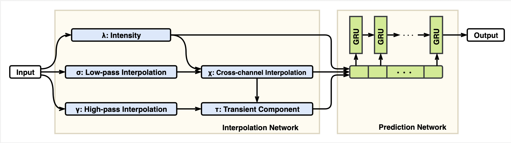
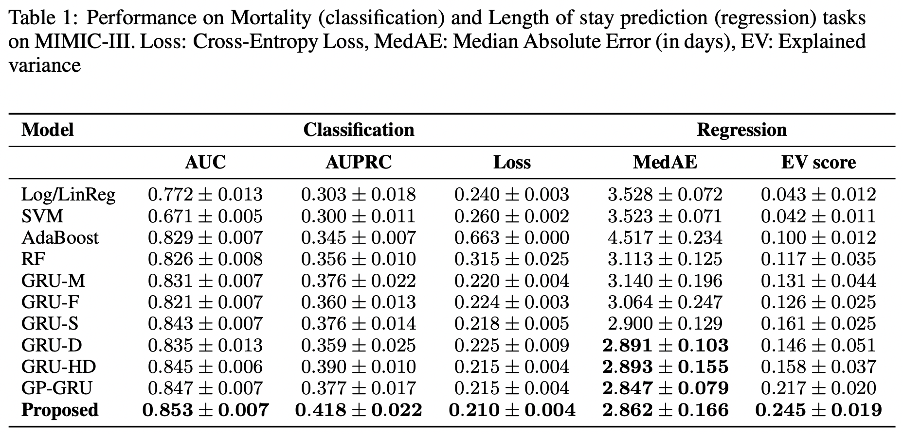
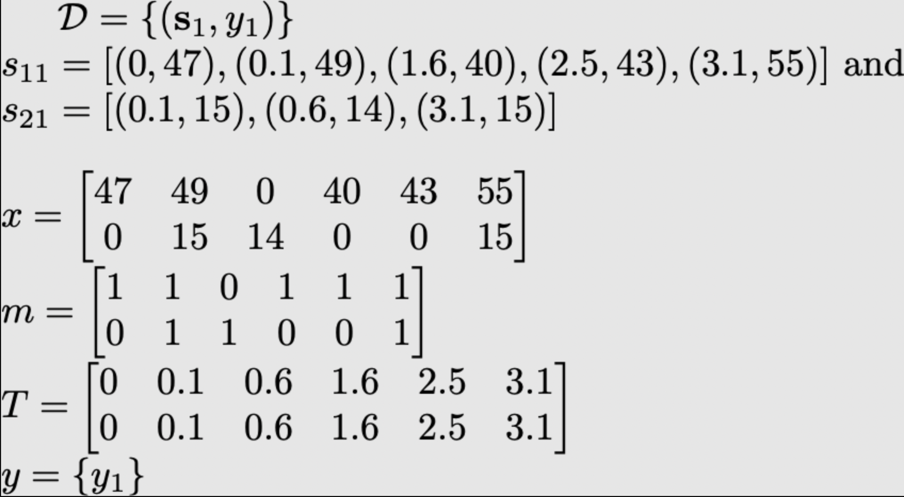

# Interpolation-Prediction Networks
This repository is an official implementation of [Interpolation-Prediction Networks for Irregularly Sampled Time Series](https://openreview.net/pdf?id=r1efr3C9Ym), accepted at ICLR 2019. In this work, we present a new deep learning architecture for addressing the problem of supervised learning with sparse and irregularly sampled multivariate time series. 
<p align="center">
  
</p>

## Requirements
The code requires Python 3.7 or later. The file [requirements.txt](requirements.txt) contains the full list of
required Python modules.
```bash
pip install -r requirements.txt
```

## Training and Evaluation
For running our model on univariate time series (UWave dataset):
```bash
python src/univariate_example.py --epochs 1000 --hidden_units 2048 --ref_points 128 --batch_size 2048
```
To reproduce the results on MIMIC-III Dataset, first you need to have an access to the dataset which can be requested [here](https://mimic.physionet.org/gettingstarted/access/). Once your application to access MIMIC has been approved, you can download the [data](https://physionet.org/works/MIMICIIIClinicalDatabase/). MIMIC is provided as a collection of comma-separated (CSV) files. You can use these [scripts](https://physionet.org/works/MIMICIIIClinicalDatabase/) to import the csv files into a database. Assuming you installed postgres while creating the database, you need to install psycopg2 using
```bash
pip install psycopg2
```
Once the database has been created, run these scripts in order.
```bash
python src/mimic_data_extraction.py
python src/multivariate_example.py --epochs 1000 --reference_points 192 --hours_from_adm 48 --batch_size 256 --gpus 4
```

## Results
Classification and regression performance on MIMIC-III.
<p align="center">
  
</p>

## Data Format Example
The notations here align with the notation section 3.1 in the paper. For brevity, lets assume we have just one example in the training set and dimension `d = 2`. 
<p align="center">
  
</p>

## Reference
```bash
@inproceedings{
shukla2018interpolationprediction,
title={Interpolation-Prediction Networks for Irregularly Sampled Time Series},
author={Satya Narayan Shukla and Benjamin Marlin},
booktitle={International Conference on Learning Representations},
year={2019},
url={https://openreview.net/forum?id=r1efr3C9Ym},
}
```

## Contact
For more  details, please contact <snshukla@cs.umass.edu>. 


